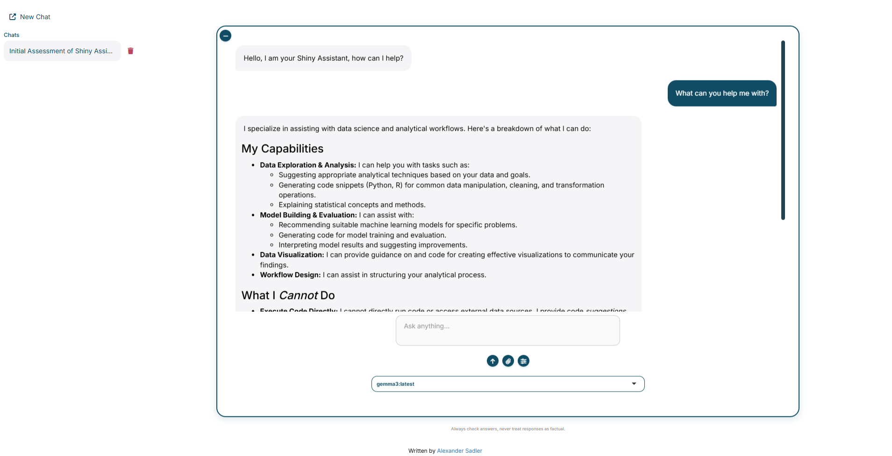

# shinychatbot
Localised R Shiny Interface for Ollama LLM Interaction.

An interactive web application built in R Shiny providing an interface for querying local Large Language Models (LLMs) via Ollama. This tool ensures complete data privacy and interrogation by keeping all inference and processing local.



## Key features
- **Deploy local models:** Interface directly with any model hosted on your local Ollama instance.
- **Save chat history:** Save and delete chat logs.
- **Customise chat behaviour:** Define chat behaviour using customised system prompts.
- **Interrogate complex datasets:** Upload `.csv`, `.pdf` or `.txt` files to query and analyse within the chat using a bespoke RAG model.

## Getting started
You must download a local installation of [Ollama](https://github.com/ollama/ollama). Verfiy your installation using `http://localhost:11434` in your browser. You should see an "Ollama is running" message. You must download models for them to be accessible from within the R Shiny application:

```bash
ollama pull <model_name>
```

### Clone the repository

```bash
git clone https://github.com/aes21/shinychatbot.git
cd shinychatbot
```

### Run the application
Install R environment dependencies.

```bash
Rscript -e "renv::restore()"
```

Otherwise, install the core package dependencies (all available via CRAN):

- `bslib`
- `commonmark`
- `httr`
- `jsonlite`
- `markdown`
- `shiny`, `shinydashboard`, `shinyjs`, `shinyWidgets`
- `stringr`

Within a new R session, initiate the application:

```r
shiny::runApp("~/shinychatbot")
```
